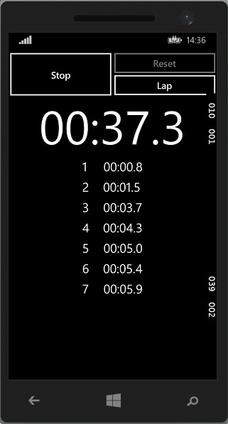
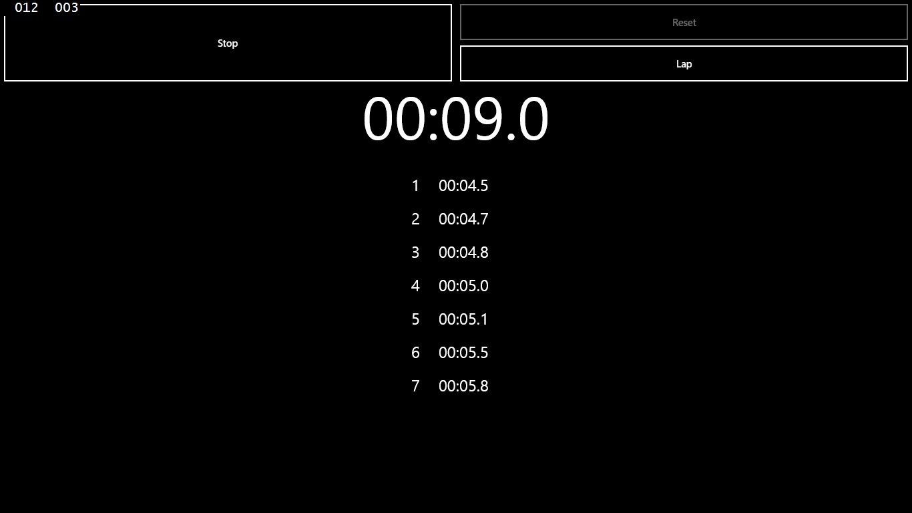

### Good-Stoper-universal-apps
==========================
This is simple universal application for windows phone 8.1 and windows 8.1

## About app:
```
We can measure the time and catch him. They are three buttons: Start/Stop, Reset and Lap.
Start/Stop button just activete stoper. One click starts time up, second stop.
Reset button, this button clear the list and main time in stoper.
Lap button, when we click this button, we can catch the time to list.
```
### Screenshots:

### Windows Phone:


### Windows App:


